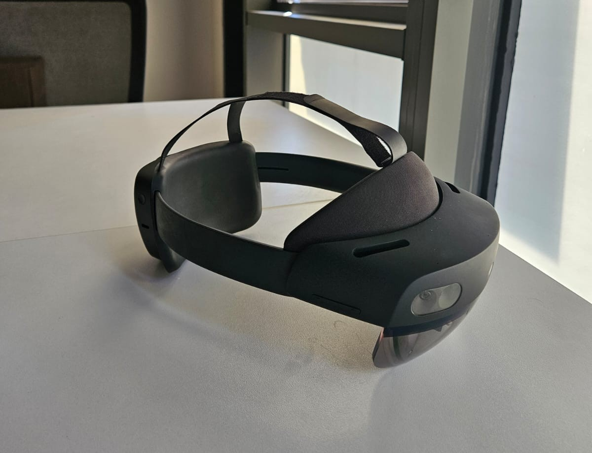
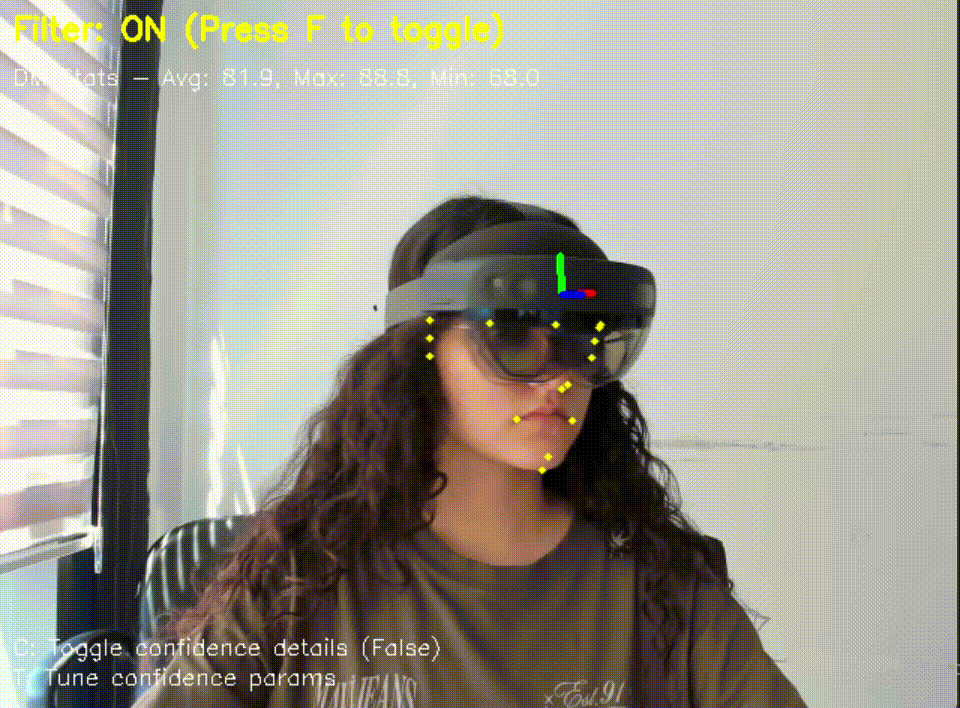
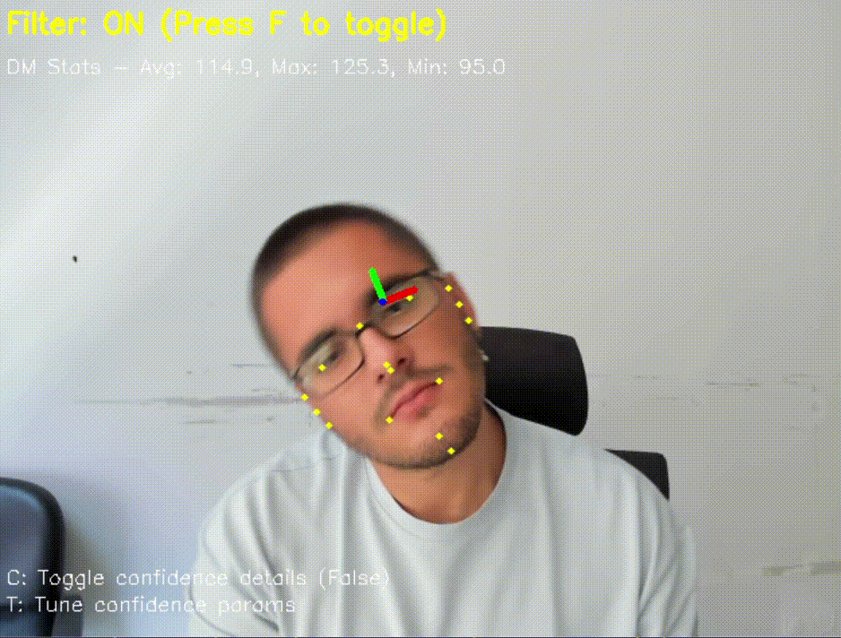

# HSOMP Outside Marker Tracking (FaceMesh Edition)

This repository is part of the **HSOMP (Hologram Stability on Moving Platform)** project.  
In this version, **the external camera estimates the HoloLens 2 position and rotation using a face (via MediaPipe FaceMesh)** and sends the data to the HoloLens via **UDP**.  
It improves hologram stability when **SLAM** and **IMU** sensors of the HoloLens fail or produce inaccurate results.

## 📌 Problem

When using HoloLens 2 on moving platforms (e.g., vehicles, tanks), **IMU sensor drift** can occur.  
If SLAM algorithms also fail, holograms begin to drift and lose alignment.  
This module solves the problem by using **an external camera to track the user's face** and estimate the pose.

<p align="center">
  
  <br>
</p>

## 🚀 Features

- Face tracking using **MediaPipe FaceMesh**  
- **3D position & rotation** estimation  
- **Adaptive Kalman filter** for smoothing  
- **UDP transmission** to HoloLens  

## 📦 Technologies

- **Python**  
- **OpenCV**  
- **MediaPipe FaceMesh**  
- **Kalman Filter**  
- **UDP Networking**

## 🔧 Installation

```bash
git clone https://github.com/xr-internship-team/hsomp-outside-marker-tracking.git
```

Install dependencies:
```bash
pip install -r requirements.txt
```

## 📷 Camera Calibration

To estimate pose correctly, you must calibrate your camera and generate the `calib_params.npz` file.

### Steps:

1. Print a **9x6 checkerboard** (each square 2.5 cm).  
2. Take several images from various angles and distances and save them (e.g., in `calib_images/`).  
3. Run the calibration script:
   ```bash
   python calibCamera.py
   ```
   This will process all images and save the calibration as `calib_params.npz`.

4. Place the `calib_params.npz` file in the project root directory.

> `markerTracking.py` will automatically load this file.

## ▶ Usage

1. Connect and configure your external camera.  
2. Run the tracking script:
```bash
python markerTracking.py
```

- You can enable CSV logging by setting `ENABLE_CSV_LOG = True` in the script.

The system will:

- Detect the face with FaceMesh  
- Estimate position and rotation  
- Apply Kalman filtering  
- Send the data via UDP to HoloLens


## 🎥 Demo Videos

- Tracking WITH Hololens:  
 <p align="center">
  
  <br>
  <em>Real-time FaceMesh tracking, pose estimation and Kalman filtering.</em>
</p>

- Tracking WITHOUT Hololens:  
<p align="center">
  
  <br>
  <em>Real-time FaceMesh tracking, pose estimation and Kalman filtering.</em>
</p>

## 🔗 Related Repository

For the Unity + MRTK application that runs on HoloLens 2 and receives the tracking data from this system:  
[HSOMP Holographic Visualizer](https://github.com/xr-internship-team/hsomp-holographic-visualizer)

## 📜 License

This project is licensed under the terms specified in the repository.

## 📄 Comparison Report

For a detailed explanation of **why FaceMesh was chosen over AprilTag**, see the following document:  
[assets/facemesh_vs_apriltag_report.pdf](assets/facemesh_vs_apriltag_report.pdf)
